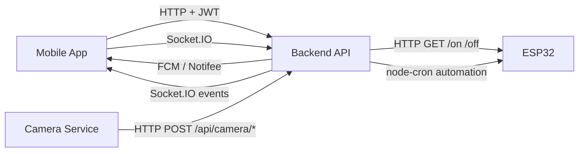

# iControlHome


## Table of Contents

- [Overview](#overview)
- [System Overview](#system-overview)
- [Architecture](#architecture)
- [Tech Stack](#tech-stack)
- [Key Features](#key-features)
- [Required Environment](#required-environment)
- [Project Structure](#project-structure)
- [Installation](#installation)
- [Startup Order](#startup-order)
- [Module Interaction](#module-interaction)
- [Troubleshooting](#troubleshooting)
- [Team](#team)
- [Additional Notes](#additional-notes)

## Overview

This repository contains the complete local development setup for the **iControlHome** graduation project.

The system is composed of three main modules:

1. **Mobile App** — React Native client for authentication, house/device management, automation, notifications, and realtime updates.
2. **Backend API** — Node.js + Express service with MongoDB persistence, JWT auth, Socket.IO realtime, automation worker, notifications, and camera endpoints.
3. **ESP32 + Camera Service** — MicroPython firmware for ESP32 hardware control and a Python camera service for face recognition and detection events.

The system is designed for **local LAN-based operation**, with the mobile app and camera service connecting to the backend over the same network.

The project was developed as a graduation thesis focusing on realtime IoT communication, mobile development, and smart home automation.

## System Overview

### High-level flow



Mobile App ↔ Backend API ↔ ESP32 / Camera Service

### What each module does

- **Mobile App**
  - User login/register/forgot password
  - House and room management
  - Device control and status display
  - Automation scheduling
  - Notifications and notification settings
  - Camera activity history and realtime updates

- **Backend API**
  - Authentication, authorization, and user management
  - House/device/room/automation CRUD
  - Device usage logs and incident history
  - Socket.IO realtime events for house/device state
  - Push notification delivery via Firebase Admin
  - Camera endpoints for device token registration, face recognition, and face export/register flows
  - Automation worker that directly calls ESP32 via HTTP and emits realtime updates

- **ESP32 + Camera Service**
  - **ESP32**: exposes simple HTTP endpoints to toggle LED/device outputs
  - **Camera Service**: captures webcam frames, performs face recognition, and sends detection events to backend

## Architecture

### Mobile App

The mobile app uses React Native with navigation, local storage, axios, Firebase Messaging, Notifee, and Socket.IO Client.

Key runtime config is centralized in:

- `iControlHome/src/config/backend.js`
- `iControlHome/src/database/api.js`
- `iControlHome/src/database/socket.js`

### Backend API

The backend is an Express server created in `iControlHome-api/app.js` and started through `iControlHome-api/bin/www`.

It provides:

- HTTP APIs under `/api`
- Socket.IO server on the same HTTP server
- background automation worker using `node-cron`
- Firebase integration for push notifications
- MongoDB persistence via Mongoose

### ESP32 + Camera

- **ESP32** runs MicroPython firmware from `iControlHome-esp32/main.py`
- **Camera service** runs from `iControlHome-esp32/camera.py`

The camera service uploads detection events and face metadata to backend endpoints, while the backend triggers push notifications to the mobile app.

## Tech Stack

### Mobile App

- React Native `0.83.1`
- React `19.2.0`
- React Navigation
- Axios
- AsyncStorage
- Socket.IO Client
- Firebase Messaging
- Notifee
- React Native Vector Icons
- Jest / ESLint / Prettier

### Backend API

- Node.js `>=20`
- Express `4.16`
- MongoDB + Mongoose
- Socket.IO
- JWT / bcryptjs
- Firebase Admin
- Nodemailer
- node-cron
- dotenv
- Node test runner

### ESP32 + Camera Service

- MicroPython on ESP32
- Python `3.10+`
- OpenCV
- NumPy
- `face_recognition`
- `dlib`
- `requests`
- `esptool` for flashing

## Key Features

- Smart home device control through ESP32
- Realtime synchronization using Socket.IO
- JWT-based authentication and authorization
- Face recognition camera integration
- Push notifications with Firebase Cloud Messaging
- Automation scheduling using node-cron
- Device usage logging and incident tracking
- House and room management system
- LAN-based communication between services
- Cross-module integration between mobile, backend, ESP32, and camera service

## Required Environment

### Mandatory

- **Node.js >= 20**
- **npm**
- **MongoDB** reachable from the backend
- **Wi-Fi LAN** shared between:
  - mobile device / emulator
  - backend host
  - ESP32
  - optional camera host

### Recommended for mobile

- Android Studio + Android SDK
- Emulator or physical Android device
- For iOS: Xcode
- For Genymotion: Google Play Services / GApps installed

### Required for ESP32

- ESP32 board with MicroPython support
- USB serial tool (Thonny / MicroPico / esptool)
- Wi-Fi credentials configured in `main.py`

### Required for Camera Service

- Webcam connected to the host running `camera.py`
- Python `3.10`
- `pip`

### Required secrets / config

- Backend `.env` file with:
  - `MONGO_URL`
  - `JWT_SECRET`
  - `FIREBASE_SERVICE_ACCOUNT_PATH`

A local `.env` is already present in `iControlHome-api/.env`, but you should verify it matches your environment.

## Project Structure

```text
HomeCtrlApp/
├── README.md
├── iControlHome/                 # React Native mobile app
│   ├── src/
│   │   ├── config/backend.js
│   │   ├── database/api.js
│   │   ├── database/socket.js
│   │   ├── navigation/
│   │   └── screens/
│   ├── android/
│   ├── ios/
│   └── package.json
├── iControlHome-api/             # Express + Socket.IO backend
│   ├── app.js
│   ├── bin/www
│   ├── config/
│   ├── models/
│   ├── routes/
│   ├── services/
│   ├── tests/
│   ├── .env
│   └── package.json
└── iControlHome-esp32/           # ESP32 + camera service
    ├── main.py
    ├── camera.py
    ├── requirements.txt
    ├── known_faces/
    └── README.md
```

## Installation

### 1) Clone repository

```bash
git clone <repo-url>
cd HomeCtrlApp
```

### 2) Backend API

```bash
cd iControlHome-api
npm install
```

Verify `.env` is available and contains valid values. If you want to override, set environment values before running.

### 3) Mobile App

```bash
cd ../iControlHome
npm install
```

Update the backend origin in `iControlHome/src/config/backend.js` to your local backend URL.

### 4) ESP32 firmware

Open `iControlHome-esp32/main.py` and set:

- `SSID`
- `PWD`
- `PORT` (default `8080`)

Upload the file to the ESP32 using Thonny, MicroPico, or `esptool`.

### 5) Camera Service

```bash
cd ../iControlHome-esp32
py -3.10 -m venv venv
./venv/Scripts/activate
pip install dlib-bin
pip install face-recognition --no-deps
pip install -r requirements.txt
```

Update `camera.py`:

- `SERVER_BASE_URL`
- `HOUSE_ID`
- `DEVICE_TOKEN`
- `CAMERA_INDEX`

## Startup Order

### Recommended local startup sequence

1. **Start MongoDB**
   - Ensure your MongoDB server is running and reachable.

2. **Start Backend API**

   ```bash
   cd iControlHome-api
   npm start
   ```

   Confirm the server is listening on port `3000`.

3. **Update Mobile Backend Config**
   Edit `iControlHome/src/config/backend.js` so `BACKEND_ORIGIN` points to your local backend host.

   Example:

   ```js
   const BACKEND_ORIGIN = "http://192.168.x.x:3000";
   ```

4. **Start Mobile App**

   ```bash
   cd iControlHome
   npm start
   npm run android
   ```

   If using a physical Android device, run:

   ```bash
   adb reverse tcp:8081 tcp:8081
   ```

5. **Flash / run ESP32 firmware**
   - Upload `iControlHome-esp32/main.py` to the device.
   - Ensure ESP32 is connected to the same Wi-Fi network as backend/mobile.

6. **Start Camera Service**

   ```bash
   cd iControlHome-esp32
   ./venv/Scripts/activate
   python camera.py
   ```

7. **Verify from Mobile App**
   - Login
   - Join/select a house
   - Toggle device state
   - Confirm realtime updates and notifications

## Module Interaction

### Mobile App ↔ Backend

- Mobile app sends authenticated HTTP calls to `/api`
- JWT token is stored in local storage and attached automatically
- Socket.IO connects to the same backend host for realtime events
- Push notification token is included in request headers for backend processing

### Backend ↔ ESP32

- Backend uses `node-cron` to trigger automation tasks
- For each scheduled or manual action, backend sends an HTTP GET request to the ESP32 endpoint
- The ESP32 responds with `OK` / `NOT_FOUND` depending on route validity

### Backend ↔ Camera Service

- Camera service sends face recognition payloads and registration/export requests to backend camera endpoints
- Backend stores camera-related data and can send push notifications to mobile clients

### Backend ↔ Firebase

- Firebase Admin is used by the backend to send push notifications
- Mobile app receives notifications via Firebase Messaging + Notifee

## Troubleshooting

### Backend does not start

- Check MongoDB connectivity in `MONGO_URL`
- Verify `node` version is `>=20`
- Ensure port `3000` is free
- Confirm `.env` exists and `FIREBASE_SERVICE_ACCOUNT_PATH` is valid

### Mobile app cannot reach backend

- Verify `BACKEND_ORIGIN` in `iControlHome/src/config/backend.js`
- Confirm mobile device/emulator and backend are on the same network
- Ensure backend is reachable from the device
- If using physical Android device, confirm `adb reverse tcp:8081 tcp:8081`

### Socket.IO not updating in app

- Confirm the backend is running and the Socket.IO server is available
- Verify `SOCKET_BASE_URL` matches the backend origin
- Check that the app has a valid auth token

### ESP32 not responding

- Confirm Wi-Fi credentials in `main.py`
- Confirm ESP32 and backend are on the same LAN
- Ensure the ESP32 IP is saved in the device record used by automation
- Test the endpoint directly in browser or curl

### Camera service fails

- Verify Python `3.10+`
- Confirm `dlib-bin` and `face-recognition` are installed
- Check that `SERVER_BASE_URL`, `HOUSE_ID`, and `DEVICE_TOKEN` are set correctly
- Make sure a webcam is available and `CAMERA_INDEX` points to the correct device

### Notifications do not arrive

- Ensure Firebase configuration is present
- For Genymotion, install Google Play Services / GApps
- Confirm the device FCM token is registered on the backend

## Team

### Đào Hoàng Anh

- Team Leader
- Backend Development
- ESP32 Integration
- System Architecture
- Testing & Debugging

GitHub: @katoridao

### Phạm Hoàng Hưng

- UI/UX Design
- Camera Service Integration
- User Experience Optimization
- Interface Prototyping

GitHub: @HoangHung3999

### Nguyễn Thế Vũ

- Authorization System
- JWT Permission Handling
- API Security Support
- Database Integration

GitHub: @tvucute

### Hoàng Tiệp

- Authentication System
- Account Recovery Flow
- Firebase Authentication Integration
- User Session Handling

GitHub: @Htiep-HN

## Additional Notes

- The backend currently uses a hardcoded remote origin in the mobile app config, so local development requires updating `iControlHome/src/config/backend.js` and `iControlHome-esp32/camera.py` to your local backend address.
- The backend exposes the Socket.IO server on the same port as the HTTP server.
- ESP32 hardware control is performed by direct HTTP calls from backend automation and device logic.
- Camera recognition is not a standalone mobile feature; it relies on backend endpoints and push notifications.
